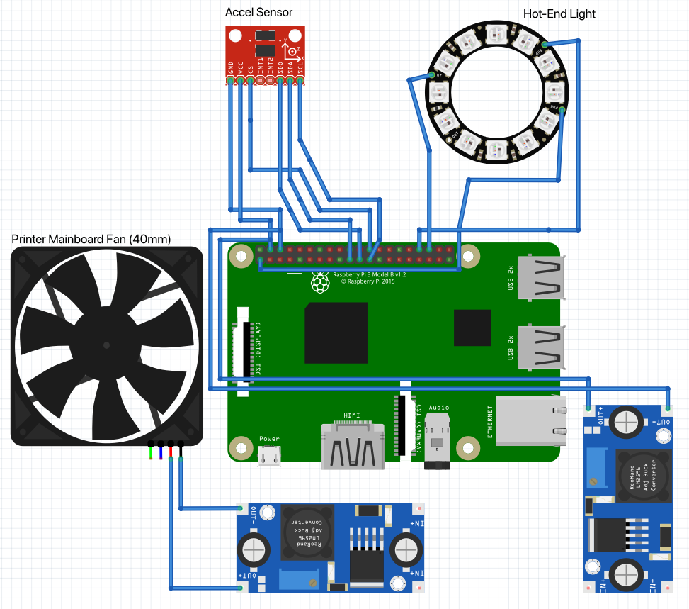

# Ender 2 Pro - Klipper
This repository serves as a configuration store for my Ender 2 Pro as well as a place to log and document any changes made to the printer

## Hardware
 - Ender 2 Pro (Purchased 05/2022 - MicroCenter St.Louis)
 - Stock Mainboard
 - Stock Hotend
 - All metal extruder upgrade
 - BLTouch Sensor
 - Nocuta 40mm fan (Motherboard)
 
## Mods
 - Modified Drawer to hold Raspberry Pi
 - Changed Motherboard fan to Nocuta 40mm 12v fan
 - BLTouch
 - Camera on Flexible LED Light arm (To be replaced)
 - Added 2 buck converters to power Motherboard fan & Raspberry

## Planned Mods
 - New Hotend shroud with Integrated NeoPixel Ring 
 - Gantry mounted Camera (ESP32-Cam or RPI Cam)
 - Remove Stock screen & replace with custom screen
 - Direct Drive upgrade

## Fritzing Diagram Notes
 In the below diagram, You cannot see that the LM295 voltage regulators that power the fan and raspberry get their input power from the printers power supply. also, the Accel Sensor is moved between Bed & Nozzle for calibration (A mount needs to be designed)

 
 (See [ender2pro-wiring.fzz](./ender2pro-wiring.fzz) for schematic)

## OS Setup
The base OS is simply Raspberry Pi OS 64-bit (or 32-bit if using an older pi OR a pi Zero) when flashing the SD card with Raspberry Pi Imager, make sure to set the default username to "bdavis" as all scripts will assume "bdavis" as the username. Once the OS has been flashed and booted, follow these steps

1. Download Kiauh https://github.com/th33xitus/kiauh (git clone repo)
2. Run Kiauh (./kiauh/kiauh.sh)
3. Go to Install and Install the following components
  3a. Klipper
  3b. Moonraker
  3c. Mainsail (and/or Fluidd - I prefer Mainsail)
  3d. Crowsnest
4. Reboot
5. Done, Move on to configuring Klipper!


## BLTOUCH
 A BLTouch bedsensor is installed directly to the mainboard using the standard 5 pin connector, I don't think any modifications are required to the connector

## Filament Runout Sensor
 Not Done

## Ansible Changes / Removal
The orignal repo by Spuder included Ansible scripts that do several tasks, I am not sure exactly how these scripts work or what they do exactly, I have copied them into this repo so I can study them and possibly extend their functionality in the future

## Setup

The following settings are for a Creality Silent board v4.2.2
```
make menuconfig
# SM32F103
# 28KiB bootloader
# Disable usb for communication
make
# Then copy the .bin file off the raspberry pi and put it on a fresh SD Card.
# The .bin file must be named something unique (and it can't be firmware.bin, or the previous file name)
````

### Resources

- Pinout: https://docs.google.com/spreadsheets/d/1DYhh9fwLnvZzuNvMoBen9Dl68KN-4TWkbO94lJ4iwe4/edit

- [Klipper on Ender 3 by YouMakeTech](https://www.youtube.com/watch?v=MaUU8stsZPo)
- [Klipper Basics - Adding BLTouch by Pigeon Print](https://www.youtube.com/watch?v=ABsdnkP4iwQ)
- [4.2.7 pinout](https://all3dp.com/2/klipper-ender-3-v2/)
- [4.2.7 pinout](https://3dprinting.stackexchange.com/questions/16078/steppers-stuck-with-klipper-but-work-with-marlin)
- [4.2.7 klipper config](https://github.com/Klipper3d/klipper/pull/3335/files)
- [Install on Ender 3 V2](https://www.youtube.com/watch?v=gfZ9Lbyh8qU)

- [Kiauh Installer](https://github.com/th33xitus/kiauh)
- [Klipper Repo](https://github.com/Klipper3d/klipper)
- [Klipper Support](https://github.com/spuder/klipper/pull/1/files)

- [Orignal Ender2Pro Config Repo](https://github.com/spuder/klipper-ender2pro)

## Extruder Calibration

- https://3dprintbeginner.com/extruder-calibration-guide/

## Flow Calibration

- https://3dprintbeginner.com/flow-rate-calibration/


 # Credit & Thanks
 This repository was inspired by and modeled after [This Repo by Spuder](https://github.com/spuder/klipper-ender2pro), I used all of his macros, playbooks, extras and ansible scripts (THANK YOU SPUDER!)